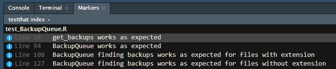

# testthis

<!-- badges: start -->

[](https://cran.r-project.org/package=testthis)
[](https://travis-ci.org/s-fleck/testthis)
[](https://codecov.io/gh/s-fleck/testthis?branch=master)
<!-- badges: end -->

**testthis** makes unit testing in R more comfortable. It is designed to
complement the packages [testthat](https://github.com/r-lib/testthat),
[devtools](https://github.com/r-lib/devtools) and
[usethis](https://github.com/r-lib/usethis).

## Overview

testthis provides RStudio addins for working with files that contain
tests. These can be called like normal R function, but it is also
possible to assigned them to hotkeys RStudio (*Tools/Modify Keyboard
Shortcuts*).

  - `test_this()`: Reloads the package and runs tests associated with
    the currently open R script file.
  - `open_testfile()`: Opens the associated test file in an editor
    window. If the currently open file already is a test file, it opens
    the associated file in the `/R` directory. Can be used to jump back
    and forth between both.

The *associated test file* for a file `R/foo.R` is usually
`/tests/testhat/test_foo.R` (or `test-foo.R`). You can modify this
behavior by putting the comment `#* @testfile anotherfile` anywhere in
`R/foo.R`.

testthis also provides functions for managing tests in subdirectories of
`tests/testthat`:

  - `use_testdata()` places a single R object in the
    `tests/testhat/testdata` directory. It is analogous to
    `usethis::use_data()`, except that it saves the object in the `.rds`
    format, which is more appropriate for single R objects than `.rda`
    or `.Rdata` (see `?readRDS`).

  - `use_testdata_raw()` creates a script-file in the directory
    `tests/testhat/testdata-raw`. The `testdata-raw` directory should
    contain all script files used to generate the data in
    `tests/testhat/testdata`, analogous to the relationship between
    `/data` and `/data-raw` as recommended by *devtools*/*usethis*.

  - `find_testdata()` and `read_testdata()` are simple helpers to read
    files saved with `use_testdata()`.

  - `use_test_subdir()` and `test_subdir()` for putting/running tests in
    subdirectories of `tests/testhat/`. These tests will *not* be run on
    CRAN or by `devtools::test()`. This is useful for tests that take a
    long time to execute, or that require external resources (web,
    databases) that may not always be available.
    
    `test_acceptance()`, `test_manual()` and `test_integration()` are
    presets to run tests in the `integration_tests`, `acceptance_tests`
    and `manual_tests` subdirectories of `test/testthat`.

Testthis also provides some simple code analysis tools

  - `test_coverage()` lists all functions of package and shows whether
    they are mentioned in any `test_that()` call’s desc argument;
    e.g. if you have a test file containing `test_that("testing that
    function foo works", <...>)`, `foo()` will show up marked as tested.
    This can be used as a simple todo list for testing, but does not
    replace a proper test coverage analyzer like
    [covr](https://github.com/r-lib/covr).
  - `test_index()` produces an index of all `test_that()` calls.
    Supports RStudio Markers when run interactively from within RStudio.

For more details see the [function
reference](https://s-fleck.github.io/testthis/reference/index.html)

## Installation

    # Testthis is on CRAN:
    install.packages("testthis")
    
    # You can also install the development version from GitHub:
    # install.packages("remotes")
    remotes::install_github("s-fleck/testthis")

## Usage

``` r
library(testthis)
```

RStudio addins (can be assigned to hotkeys):

``` r
open_testfile()
## The file `tests/testthat/test_myscript.R` does not exist. 
## You can create it with testthis::test_skeleton().

test_skeleton()
## * Creating `tests/testthat/test_myscript.R`

open_testfile()
## > Opens `tests/testthat/test_myscript.R`

test_this() 
## > Runs tests in `tests/testthat/test_myscript.R`
## > works from the original .R file as well as from the file containing the tests
```

Code analysis:

``` r
test_index()
```



``` r
test_coverage()

## > Package /data/home/fleck/rpkgs/rotor, Test Coverage: 17.8%
## >
## > exported functions .................... 
## > u fun          
## > + backup       
## > + backup_date  
## > + backup_time  
## > ...

# 'u' stands for 'unit tests', more columns are possible if you use the 
# test_subdir() feature of testthis
```
